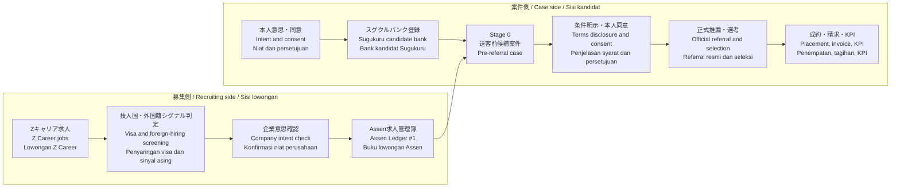
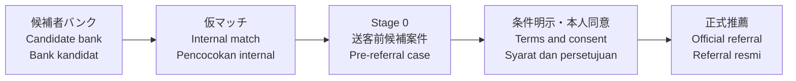
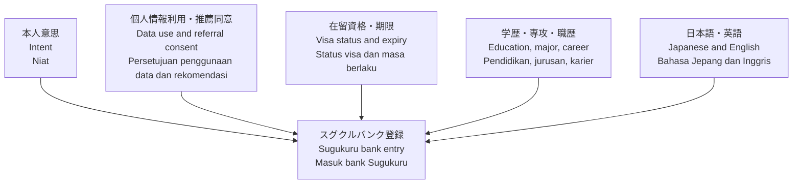

# Assen × Zキャリア 技人国紹介フロー / Assen × Z Career Engineer/Specialist Placement Flow / Alur Penempatan Engineer/Specialist Assen × Z Career

## この資料の目的 / Purpose / Tujuan

この資料は、有料職業紹介の中で、Zキャリア求人から「技術・人文知識・国際業務（技人国）」で就労できる可能性がある求人を選び、インドネシア人・英語話者の候補者を安全に推薦へ進めるための全体図です。

This guide explains how Sugukuru screens Z Career jobs for Engineer/Specialist in Humanities/International Services visa fit, then safely moves Indonesian or English-speaking candidates toward referral.

Panduan ini menjelaskan bagaimana Sugukuru menyaring lowongan Z Career yang cocok untuk visa Engineer/Specialist, lalu mengarahkan kandidat Indonesia atau penutur Inggris menuju referral secara aman.

この資料はZキャリア伴走者にも共有できる前提です。ただし、候補者の氏名・連絡先・在留カード・パスポート・内部URL・Cloud Run URL・OAuth値・SlackチャンネルIDは含めません。

This version can be shared with Z Career support partners. It does not include candidate PII, internal URLs, Cloud Run URLs, OAuth values, or Slack channel IDs.

Versi ini dapat dibagikan kepada pendamping Z Career. Dokumen ini tidak memuat data pribadi kandidat, URL internal, URL Cloud Run, nilai OAuth, atau ID channel Slack.

---

## 1. 全体像 / Overall Picture / Gambaran Umum

重要なのは、募集側と案件側を混ぜないことです。Zキャリア求人は、企業意思・技人国可否・紹介条件を確認してからAssenの求人管理簿に入れます。候補者は、本人意思と同意を確認してからスグクルのバンクに入れます。

The key is to separate the recruiting side from the case side. A Z Career job enters Assen only after company intent, visa fit, and placement terms are confirmed. A candidate enters Sugukuru's bank only after intent and consent are confirmed.

Hal penting adalah memisahkan sisi lowongan dan sisi kandidat. Lowongan Z Career masuk ke Assen hanya setelah niat perusahaan, kecocokan visa, dan syarat penempatan dikonfirmasi. Kandidat masuk bank Sugukuru hanya setelah niat dan persetujuan dikonfirmasi.

---

## 2. Stage 0の意味 / What Stage 0 Means / Arti Stage 0

Stage 0は「送客前候補案件」です。スグクルが紹介契約を結んだ、企業へ正式推薦した、成約した、という意味ではありません。

Stage 0 means a pre-referral case. It does not mean a signed placement contract, official referral to the company, or successful placement.

Stage 0 berarti kasus sebelum referral. Ini bukan kontrak penempatan, bukan referral resmi ke perusahaan, dan bukan penempatan berhasil.

Stage 0でやることは、候補者と求人の整合性を内部で確認することです。本人同意なしに企業へ個人情報を出さず、技人国の専攻関連性・業務実態・日本語/英語条件・勤務地・年収を確認します。

At Stage 0, Sugukuru checks candidate-job fit internally. Candidate PII is not sent to the company before consent. The team checks visa-major fit, actual duties, language requirements, location, and salary.

Pada Stage 0, Sugukuru memeriksa kecocokan kandidat-lowongan secara internal. Data pribadi kandidat tidak dikirim ke perusahaan sebelum persetujuan. Tim memeriksa kecocokan visa-jurusan, isi pekerjaan, syarat bahasa, lokasi, dan gaji.

---

## 3. ステージ別にやること / Stage-by-Stage Actions / Aksi per Tahap

| Stage | 目的 / Purpose / Tujuan | やること / Action / Aksi | 成果物 / Output / Output | 止める条件 / Guardrail / Batas |
|---|---|---|---|---|
| 0. 求人候補 / Job candidate / Kandidat lowongan | Zキャリア在庫から技人国で可能性のある求人を見つける | CSV化、職種足切り、外国籍・日本語・英語シグナル判定 | 優先確認リスト、企業別サマリー | シェア求人テンプレを企業意思と誤認しない |
| 1. 企業確認 / Company check / Cek perusahaan | 本当に外国籍・技人国候補者を推薦できる求人にする | 在留資格、業務実態、学歴専攻、報酬、返金条件を確認 | Assen求人管理簿へ登録できる求人 | 施工管理・現業寄り・身分系限定は送客前に止める |
| 2. バンク登録 / Bank entry / Masuk bank | 本人同意済みで、推薦可能な求職者だけを扱う | 同意、在留資格、期限、学歴、専攻、職歴、言語を確認 | スグクル求職者バンク | 同意前に企業へ個人情報を出さない |
| 3. Stage 0 / Pre-referral / Pra-referral | 求人×候補者の仮マッチを内部で管理する | 技人国整合、候補者希望、言語、勤務地、年収を確認 | 送客前候補案件、確認TODO | 契約済み・正式推薦・成約ではない |
| 4. 条件明示 / Terms disclosure / Penjelasan syarat | 候補者が条件を理解し、推薦に同意している状態にする | WF-15A相当、本人同意、交付記録、承認 | 推薦可能な紹介行 | 曖昧な条件・未承認文書では推薦しない |
| 5. 成約後 / After placement / Setelah diterima | 帳簿・請求・届出期限・KPIを一気通貫で残す | `placement_confirm`、`invoice_create_draft`、Slack通知、月次集計 | 帳簿③、請求ドラフト、期限、経路別KPI | 入社確定前に請求・成約KPIへ入れない |

---

## 4. Zキャリア伴走者に確認したいこと / Questions for Z Career Support / Pertanyaan untuk Pendamping Z Career

Zキャリア伴走者には、候補者個人情報ではなく「求人側の確認事項」を共有します。

Share job-side questions with Z Career partners, not candidate personal data.

Bagikan pertanyaan terkait lowongan kepada pendamping Z Career, bukan data pribadi kandidat.

| 論点 / Topic / Topik | 確認質問 / Question / Pertanyaan |
|---|---|
| 技人国 / Visa fit / Kecocokan visa | この求人は技術・人文知識・国際業務の候補者を推薦できますか。 |
| 記載の出どころ / Source of statement / Sumber keterangan | 外国籍可・技人国可の文言は企業確認済みですか、共有元テンプレですか。 |
| 業務実態 / Actual duties / Isi pekerjaan nyata | 仕事内容は設計・開発・通訳・専門事務ですか。現場作業・施工管理中心ではありませんか。 |
| 候補者条件 / Candidate requirements / Syarat kandidat | 日本語N1/N2必須か、日常会話/英語話者でも検討可能ですか。 |
| 紹介条件 / Placement terms / Syarat penempatan | 報酬、返金条件、シェア求人の成約時条件を確認できますか。 |

---

## 5. スグクルバンクに入る求職者 / Candidate Bank Entry / Kandidat yang Masuk Bank Sugukuru

スグクルのバンクに入るのは、単に「仕事を探している人」ではありません。本人意思・同意・在留資格・学歴専攻・職歴・言語条件が確認でき、スグクルが企業へ推薦してよいと判断できる人です。

Sugukuru's bank is not just a list of job seekers. A candidate enters the bank only when intent, consent, visa status, education/major, work history, and language level are confirmed, and Sugukuru can responsibly recommend the person.

Bank Sugukuru bukan sekadar daftar pencari kerja. Kandidat masuk bank hanya jika niat, persetujuan, status visa, pendidikan/jurusan, riwayat kerja, dan kemampuan bahasa sudah dikonfirmasi, serta Sugukuru dapat merekomendasikannya secara bertanggung jawab.

---

## 6. Assenが正本として持つもの / What Assen Keeps as Source of Truth / Data yang Menjadi Sumber Kebenaran di Assen

| 領域 / Area / Area | Assenで残すもの / Stored in Assen / Disimpan di Assen |
|---|---|
| 求人 / Job order / Lowongan | 求人管理簿、企業確認履歴、技人国・職安法ゲート、スコア |
| 求職者 / Candidate / Kandidat | 本人意思、同意、在留資格、学歴・職歴、紹介可能状態 |
| 紹介 / Referral / Referral | Stage 0、条件明示、本人同意、正式推薦、選考結果 |
| 成約 / Placement / Penempatan | 帳簿③、請求ドラフト、返金・届出期限、月次KPI |
| 監査 / Audit / Audit | 誰が、いつ、何を、どの根拠で変更したかのハッシュチェーン |

AssenはAIの自動判断だけで法定書類を確定しません。生成される文書はドラフトであり、人間の承認後に初めて確定します。

Assen never finalizes statutory documents by AI judgment alone. Generated documents are drafts until human approval.

Assen tidak menetapkan dokumen hukum hanya berdasarkan keputusan AI. Dokumen yang dibuat adalah draf sampai disetujui manusia.

---

## 7. 次に組み立てる資料 / Next Materials to Build / Materi Berikutnya

1. Zキャリア伴走者向け1枚資料：企業確認質問、共有求人の注意点、スグクルが候補者PIIを出す前の条件。
2. 社内チーム向け運用手順：Stage 0、WF-15A、正式推薦、成約後処理をステージ別に説明。
3. Drive保存用HTML/PDF：図が崩れないようにinline SVGで作成する。

1. One-page Z Career partner brief: company-check questions, shared-job cautions, and conditions before Sugukuru shares candidate PII.
2. Internal team operations guide: Stage 0, WF-15A, official referral, and post-placement actions by stage.
3. Drive-ready HTML/PDF: use inline SVG so diagrams remain stable.

1. Materi 1 halaman untuk pendamping Z Career: pertanyaan cek perusahaan, perhatian untuk shared job, dan syarat sebelum Sugukuru membagikan data kandidat.
2. Panduan operasional internal: Stage 0, WF-15A, referral resmi, dan proses setelah penempatan per tahap.
3. HTML/PDF siap Drive: gunakan inline SVG agar diagram tidak rusak.
