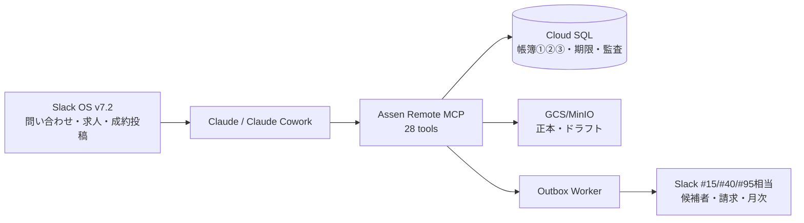
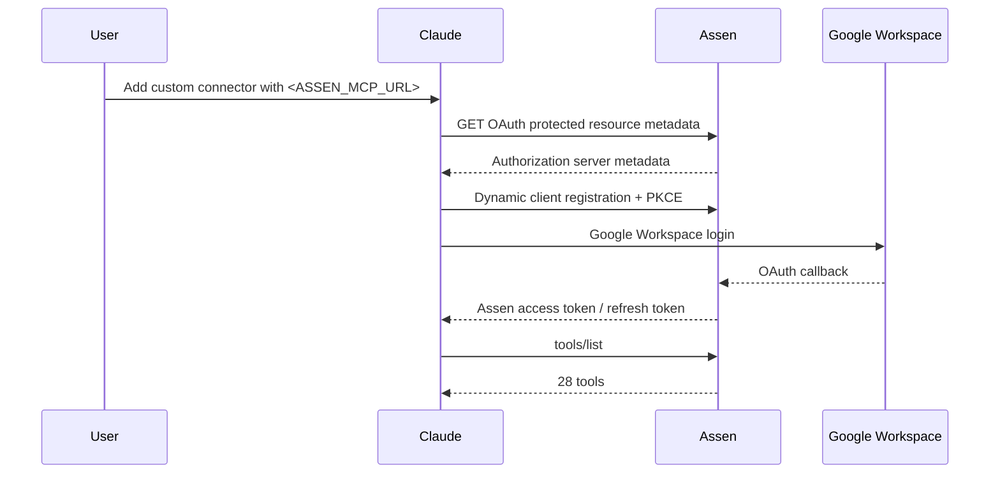
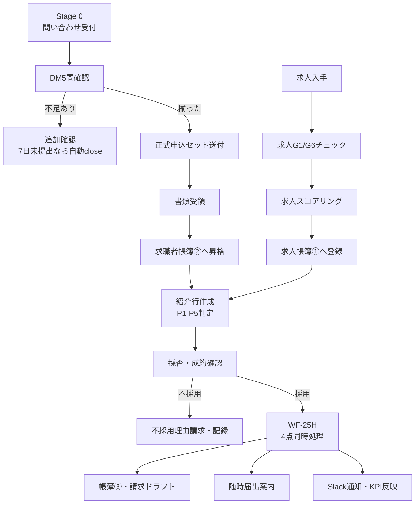

# Assen 社内本番 運用手順書 / Internal Production Operation Manual / Panduan Operasi Produksi Internal

この手順書は、AssenをClaudeとSlack OS v7.2で実務利用するための「最初の1件」から日次・週次・月次運用までの流れをまとめたものです。公開リポジトリに置くため、Cloud Run URL、Slack channel ID、GCP project IDなどの実値は書きません。社内配布版では`<ASSEN_MCP_URL>`などを実値に差し替えてください。

This manual explains how to use Assen in real internal operations with Claude and Slack OS v7.2, from the first case through daily, weekly, and monthly routines. Because this file is stored in a public repository, live Cloud Run URLs, Slack channel IDs, and GCP project IDs are intentionally omitted. Replace placeholders such as `<ASSEN_MCP_URL>` in the internal copy.

Panduan ini menjelaskan cara memakai Assen dalam operasi internal nyata dengan Claude dan Slack OS v7.2, mulai dari kasus pertama sampai rutinitas harian, mingguan, dan bulanan. Karena file ini disimpan di repositori publik, URL Cloud Run, ID channel Slack, dan ID project GCP tidak ditulis. Ganti placeholder seperti `<ASSEN_MCP_URL>` pada salinan internal.

---

## 0. 結論 / Summary / Ringkasan

社内MVPでは、Claudeを操作画面、Assenを法定帳簿・証跡・期限の正本、Slack OS v7.2を人間の判断と通知の場として使います。

Claude is the operator interface, Assen is the source of truth for statutory ledgers/evidence/deadlines, and Slack OS v7.2 is the human decision and notification layer.

Claude adalah antarmuka operator, Assen adalah sumber kebenaran untuk buku besar hukum/bukti/tenggat, dan Slack OS v7.2 adalah lapisan keputusan serta notifikasi manusia.



---

## 1. 役割分担 / Roles / Pembagian Peran

| 領域 | 使うもの | 役割 |
|---|---|---|
| 操作 | Claude / Claude Cowork | 自然言語でAssen toolsを呼ぶ |
| 正本 | Assen MCP | 求人帳簿、求職帳簿、手数料帳簿、期限、監査ログを保存 |
| 通知 | Slack OS v7.2 | #15候補者、#40請求、#95月次レビュー相当へ通知 |
| 保管 | GCS | ドラフト・正本の保存 |
| デプロイ | GitHub Actions | Build → migration → runtime → workerの順で反映 |

English: Claude operates the workflow, Assen stores the authoritative records, Slack handles human review/notifications, GCS stores artifacts, and GitHub Actions deploys.

Bahasa Indonesia: Claude menjalankan workflow, Assen menyimpan catatan resmi, Slack menangani review/notifikasi manusia, GCS menyimpan artefak, dan GitHub Actions melakukan deploy.

---

## 2. 初回接続フロー / First Connection Flow / Alur Koneksi Pertama

### 2.1 前提 / Prerequisites / Prasyarat

- Google WorkspaceメールがAssen allowlistに登録済みであること
- ClaudeでCustom Connectorを追加できること
- AssenのMCP URLを知っていること: `<ASSEN_MCP_URL>`
- 通常は手動token取得をしないこと

English: The user must be allowlisted, able to add a Claude custom connector, and know `<ASSEN_MCP_URL>`. Manual token handling is not used in normal operations.

Bahasa Indonesia: Pengguna harus masuk allowlist, bisa menambahkan custom connector Claude, dan mengetahui `<ASSEN_MCP_URL>`. Token manual tidak dipakai dalam operasi normal.



### 2.2 Claude接続手順 / Claude Setup / Pengaturan Claude

1. Claudeの`Settings → Connectors → Add custom connector`を開く。
2. Remote MCP server URLに`<ASSEN_MCP_URL>`を入れる。
3. Google Workspaceログイン画面が出たら、社内メールでログインする。
4. Claudeに「Assenで使えるツールを一覧して」と聞く。
5. `tools/list`で28 toolsが返れば成功。

English:
1. Open `Settings → Connectors → Add custom connector`.
2. Enter `<ASSEN_MCP_URL>`.
3. Sign in with Google Workspace.
4. Ask Claude to list available Assen tools.
5. Success means `tools/list` returns 28 tools.

Bahasa Indonesia:
1. Buka `Settings → Connectors → Add custom connector`.
2. Masukkan `<ASSEN_MCP_URL>`.
3. Login dengan Google Workspace.
4. Minta Claude menampilkan tool Assen.
5. Berhasil jika `tools/list` mengembalikan 28 tool.

---

## 3. 業務全体フロー / Business Flow / Alur Bisnis



---

## 4. 最初の1件の進め方 / First Case Procedure / Prosedur Kasus Pertama

### 4.1 問い合わせを受けたら / When an Inquiry Arrives / Saat Ada Inquiry

Claudeに依頼:

```text
AssenでStage 0問い合わせを記録してください。
氏名: ...
経路: sns_application
DM回答:
- 在留資格:
- 在留期限:
- 居住地:
- 職歴・分野:
- 日本語:
- 希望:
メモ: ...
```

期待されるAssen tool:
- `inquiry_record`
- 不足があれば`inquiry_update`
- セット完備後に`inquiry_promote`

English: Record Stage 0 first, update missing answers, then promote only after the formal application set is complete.

Bahasa Indonesia: Catat Stage 0 terlebih dahulu, lengkapi jawaban yang kurang, lalu promote hanya setelah paket lamaran resmi lengkap.

### 4.2 求人を受けたら / When a Job Order Arrives / Saat Ada Lowongan

Claudeに依頼:

```text
この求人をAssenに取り込んで、職安法G1/G6チェックとスコアリングまでしてください。
求人原文:
...
```

期待されるAssen tool:
- `job_order_analyze`
- `job_order_gate_check`
- `job_order_score`
- `job_order_confirm`

判断基準:
- S: 原則追う
- A: 条件確認して追う
- B/C: 原則追わない
- 建設監督など例外は壁・吉原判断

### 4.3 紹介行を作る / Create Referral / Buat Referral

Claudeに依頼:

```text
この求人と候補者を紹介行として紐付けてください。
placementPatternはP3です。
紹介日: YYYY-MM-DD
条件明示書・同意書に必要な項目も確認してください。
```

P1-P5:
- P1: 純紹介×Zキャリア
- P2: 純紹介×直接求人
- P3: 紹介予定派遣
- P4: 派遣→純紹介切替
- P5: スグクル派遣→WIN移行

English: Create the referral row only after both job order and job seeker records exist. P5 must be explicit.

Bahasa Indonesia: Buat baris referral hanya setelah lowongan dan pencari kerja sudah tercatat. P5 harus disebutkan eksplisit.

### 4.4 成約したら / When Placement Is Confirmed / Saat Penempatan Berhasil

Claudeに依頼:

```text
この紹介行を成約確定してください。
conversionType: standard_placement_hire
採用日: YYYY-MM-DD
雇用主:
- 会社ID:
- 名称:
- 住所:
- 代表者:
- 担当者:
手数料:
- feeType: todokede
- amountInclTax:
- calcBasisWage:
- calcBasisRate:
```

P5/WIN移行で金額未定なら:

```text
conversionType: win_transition
feeStatus: pending_negotiation
feeは未定なので省略
```

Assenが同時に行うこと:
1. 紹介行を`placed`へ更新
2. 帳簿③`fee_records`へ記帳
3. `fee_invoice_drafts`へ請求ドラフト作成
4. 随時届出3-1-2/3-1-1の期限案内
5. #15相当と#40相当へSlack通知

English: `placement_confirm` is the WF-25H trigger. It posts the fee ledger, invoice draft, filing guidance, and Slack notifications in one transaction/outbox flow.

Bahasa Indonesia: `placement_confirm` adalah pemicu WF-25H. Tool ini mencatat buku biaya, draf tagihan, panduan laporan, dan notifikasi Slack dalam satu alur transaksi/outbox.

---

## 5. 日次・週次・月次運用 / Daily, Weekly, Monthly Operations / Operasi Harian, Mingguan, Bulanan

### 5.1 毎朝 / Every Morning / Setiap Pagi

1. Claudeで`morning-scan`を呼ぶ。
2. 新着求人をG1/G6チェックする。
3. S/A案件だけ候補者と突合する。
4. Stage 0で7日未提出の問い合わせはworkerが自動closeする。

### 5.2 月曜30分 / Monday Review / Review Senin

Claudeに依頼:

```text
weekly-reviewを実行して、今週の問い合わせ→正式申込→候補者→推薦→面接→内定→成約のボトルネックを1つだけ特定してください。
必要ならSlack #15相当へ投稿してください。
```

見る数字:
- 問い合わせ数
- 正式申込セット送付
- セット受領
- 候補者昇格
- 推薦
- 面接
- 内定
- 成約
- 経路別転換率
- 成果区分別の確定/見込収益

### 5.3 月末 / Month End / Akhir Bulan

Claudeに依頼:

```text
report_monthly_summaryで今月の月次レポートを作成し、#95相当へ投稿してください。
対象月: YYYY-MM
```

期待される内容:
- 月次ファネル
- 経路別転換率
- 純紹介／派遣入職／WIN管理の3区分
- 確定手数料
- 派遣粗利見込
- WIN管理費見込
- 翌月の停止広告・強化レーン

---

## 6. Slack OS v7.2通知 / Slack OS v7.2 Notifications / Notifikasi Slack OS v7.2

| 通知 | 投稿先 | 起点 |
|---|---|---|
| 候補者・成約・T2P期限 | #15相当 | `placement_confirm`, deadline worker |
| 請求ドラフト | #40相当 | `placement_confirm`, `invoice_create_draft` |
| 月次レポート | #95相当 | `report_monthly_summary` |
| 文書承認 | 既存承認チャンネル | `document_request_approval` |

実値は`SLACK_KPI_CHANNEL_ID`、`SLACK_FINANCE_CHANNEL_ID`、`SLACK_BOARD_CHANNEL_ID`としてGitHub variables / Cloud Run envで管理します。コードや公開docsには書きません。

The live channel IDs are stored in GitHub variables / Cloud Run environment variables, not in code or public docs.

ID channel asli disimpan di GitHub variables / environment Cloud Run, bukan di kode atau dokumen publik.

---

## 7. 監査・安全確認 / Audit and Safety Checks / Audit dan Pemeriksaan Keamanan

### 7.1 作業前チェック / Before Work / Sebelum Kerja

- Claude接続が成功している
- `tools/list`が28 toolsを返す
- 自分のGoogle Workspaceメールがallowlistにある
- 在留カード・パスポート画像をAssenへ保存しない
- 手動tokenをSlackに貼らない

### 7.2 作業後チェック / After Work / Setelah Kerja

- `document_preview`で不足項目がない
- `compliance_evaluate`でblocking findingがない
- 人間が`document_approve`したものだけ正本扱いにする
- 成約時は帳簿③と請求ドラフトが作られている
- T2Pなら4/5/6ヶ月期限が作られている
- Slack #15/#40/#95相当への通知を確認する

### 7.3 Slack選択肢マスタの前提 / Preconditions for Slack Option Masters / Prasyarat Master Opsi Slack

Phase B（Boltカスタムステップ）へ進む前に、`staff_list` / `partner_list` / `job_seeker_list` が実データで返ることを確認する。`staff_list`の`staffId`は**freee社員番号(`num`、例: `I-0004`)を既定値**とし、Secret Managerの対応表はnumが空の従業員だけを扱う「例外上書き表」（2026-08-01時点の実値は`3262070`→`RETIRED-3262070`の1件のみ。新入社員の追加では更新不要）。numも上書きも無い従業員だけが空配列ではなく明示エラーになる（解決後のstaffId重複も同様に明示エラー）。2026-08-01の実データ検証では在籍121名・全207名・取引先500件が返った。`partner_list`はfreee会計の`available`（564件）から、給与・立替精算のために取引先登録されている従業員本人など64件を`assen-freee-partner-exclusion`Secretで除外している（freee側は`available=true`のまま。経理の入力候補を壊さない）。`partner_list` はfreee会計の`available`を正とするため、7/29に除外判断した取引先はfreee側で使用停止にし、追加3社（株式会社小林グリーンファーム、株式会社パワーウィング、山崎農園）はfreee側の正式名称として登録・修正してから進める。

Before Phase B (Bolt custom steps), verify that `staff_list`, `partner_list`, and `job_seeker_list` return real data. `staff_list`'s `staffId` defaults to the freee employee number (`num`, e.g. `I-0004`); the Secret Manager mapping is now an exception-override table for employees with an empty `num` (as of 2026-08-01 it holds a single entry, `3262070` to `RETIRED-3262070`, and needs no update as new hires are added). Only employees with neither a `num` nor an override fail explicitly instead of returning an empty list (duplicate resolved staffIds also fail explicitly). The 2026-08-01 live check returned 121 active staff, 207 total staff, and 500 partners. `partner_list` starts from freee Accounting `available` (564 records) and removes 64 of them via the `assen-freee-partner-exclusion` Secret, mostly employees registered as partners for payroll/expense purposes (they stay `available=true` in freee so accounting entry is unaffected). `partner_list` treats freee Accounting `available` as authoritative, so partners excluded on 7/29 must be disabled in freee, and the three additions (Kobayashi Green Farm, Power Wing, Yamasaki Nouen) must be registered or renamed in freee before continuing.

Sebelum Phase B (custom step Bolt), pastikan `staff_list`, `partner_list`, dan `job_seeker_list` mengembalikan data nyata. `staffId` pada `staff_list` kini secara default memakai nomor karyawan freee (`num`, mis. `I-0004`); pemetaan Secret Manager menjadi tabel override pengecualian untuk karyawan yang `num`-nya kosong (per 2026-08-01 hanya berisi satu entri, `3262070` ke `RETIRED-3262070`, dan tidak perlu diperbarui saat ada karyawan baru). Hanya karyawan tanpa `num` maupun override yang gagal secara eksplisit, bukan daftar kosong (staffId hasil resolusi yang duplikat juga gagal eksplisit). Pemeriksaan data nyata pada 2026-08-01 mengembalikan 121 staf aktif, 207 staf total, dan 500 partner. `partner_list` bertolak dari `available` di freee Accounting (564 data) lalu membuang 64 di antaranya melalui Secret `assen-freee-partner-exclusion`, sebagian besar karyawan yang terdaftar sebagai partner untuk payroll/reimbursement (di freee tetap `available=true` agar input akuntansi tidak terganggu). `partner_list` memakai `available` di freee Accounting sebagai sumber kebenaran, sehingga partner yang dikeluarkan pada 7/29 harus dinonaktifkan di freee, dan tiga tambahan harus didaftarkan atau diganti nama di freee sebelum lanjut.

TTLは既定5分。freeeで新規取引先を登録した直後は、最大5分待つかruntime revisionを再起動してキャッシュを更新する。freee OAuth / Secret Manager / 権限エラーは`isError: true`で返り、正常な0件（`items: []`）とは区別する。

The default TTL is five minutes. After registering a new partner in freee, wait up to five minutes or restart the runtime revision to refresh the cache. freee OAuth / Secret Manager / permission failures return `isError: true` and are distinct from a normal zero-result response (`items: []`).

TTL default lima menit. Setelah mendaftarkan partner baru di freee, tunggu maksimal lima menit atau restart runtime revision untuk memperbarui cache. Kegagalan freee OAuth / Secret Manager / izin mengembalikan `isError: true` dan berbeda dari hasil nol yang normal (`items: []`).

### 7.4 Slackカスタムステップ（Assen Master Picker） / Slack custom step (Assen Master Picker) / Custom step Slack (Assen Master Picker)

Workflow Builderの標準フォームは実行時に外部から選択肢を取れない。`assen-slack-bolt`がカスタムステップ`pick_master_values`を提供し、モーダル内の`external_select`から`staff_list` / `partner_list` / `job_seeker_list`を呼ぶ。

Workflow Builder's built-in forms cannot load external options at runtime. `assen-slack-bolt` provides the `pick_master_values` custom step and calls `staff_list` / `partner_list` / `job_seeker_list` from modal `external_select` menus.

Form bawaan Workflow Builder tidak bisa memuat opsi eksternal saat runtime. `assen-slack-bolt` menyediakan custom step `pick_master_values` dan memanggil `staff_list` / `partner_list` / `job_seeker_list` dari menu `external_select` di modal.

手順の要約 / Summary / Ringkasan:

1. [`docs/slack-assen-master-picker-manifest.json`](slack-assen-master-picker-manifest.json) から新規Slackアプリを作成し、Org Level Appsを有効化する
2. Request URL / Options Load URL を `https://<assen-slack-bolt>/slack/events` に設定する
3. Bot Token と Signing Secret を Secret Manager（`assen-slack-bolt-bot-token` / `assen-slack-bolt-signing-secret`）へ入れる
4. Cloud Run `assen-slack-bolt` は `min-instances=1`（Options Load URLの3秒制限対策）、サービスアカウントは `assen-slack-bolt@...`（allowlist role=`system`）

トラブル / Troubleshooting / Pemecahan masalah:

| 症状 | 原因候補 | 対応 |
|---|---|---|
| 選択肢が出ない / 空 | freee障害、Bolt→Assen認証失敗、3秒タイムアウト | Boltログ・runtimeログ、`min-instances`、freee tokenを確認 |
| `team_not_allowed` | `SLACK_ALLOWED_TEAM_ID`不一致 | 自社`team_id`（`T07QM8P2VCK`）を確認 |
| ステップがIn progressのまま | `functions.completeSuccess`未呼出 | モーダル送信・`function_execution_id`を確認 |

---

## 8. トラブル対応 / Troubleshooting / Pemecahan Masalah

| 症状 | 原因候補 | 対応 |
|---|---|---|
| Claude接続でOAuthが進まない | URL誤り、allowlist未登録、Google callback未設定 | `<ASSEN_MCP_URL>`、allowlist、OAuth設定を確認 |
| `tools/list`が28未満 | 古いrevision、Claude側cache | Claude再接続、Deploy run確認 |
| Slack通知が来ない | bot未参加、channel env不足、worker停止 | bot参加、GitHub variables、Worker Pool revisionを確認 |
| Slackフォームの選択肢が取得エラーになる | freee OAuth失効、Secret Manager IAM不足、freee社員番号(num)が空で上書きも無い、解決後staffIdの重複、freee権限不足 | Secret Managerのtoken/mapping、Cloud Run service account IAM、freeeアプリ権限を確認 |
| `partner_list`に除外済み会社が出る / 追加会社が出ない | freee会計の`available`または正式名称が未清掃 | freee側で使用停止・新規登録・名称修正し、5分TTL後に再確認 |
| `partner_list`に従業員本人や社宅関連の取引先が出る | `assen-freee-partner-exclusion`に未登録 | 除外表Secretへ`partnerId`と`reason`を追記し、5分TTL後に再確認（freee側の`available`は変更しない） |
| 請求ドラフトが重複しそう | 同一紹介行に再作成 | `invoice_create_draft`の`idempotencyKey`を固定し、既存draftを確認 |
| T2P期限が重複しそう | 再確定・再実行 | `(tenant_id, subject_id, policy_key)`一意制約で防止。既存instanceを確認 |
| 本番が不安定 | 新revisionの不具合 | Cloud Run runtime / Worker Poolを直前imageへrollback。DB列・テーブルは削除しない |

---

## 9. Rollback手順 / Rollback Procedure / Prosedur Rollback

1. GitHub Actionsの最新Deploy runを確認する。
2. 直前の成功revisionとimage SHAを確認する。
3. Cloud Run runtimeを直前imageへ戻す。
4. Worker Poolを直前imageへ戻す。
5. DB migrationは加算的なので、列・テーブルを削除しない。
6. `/health`、`/ready`、OAuth discovery、Slack worker logを確認する。

English: Roll back compute first. Do not drop additive DB migrations during an incident.

Bahasa Indonesia: Rollback compute terlebih dahulu. Jangan hapus migrasi DB tambahan saat insiden.

---

## 10. 初回シャドーラン台本 / First Shadow Run Script / Naskah Shadow Run Pertama

1. `inquiry_record`で架空ではない社内検証用問い合わせを1件記録する。
2. `inquiry_update`で正式申込セット送付・受領を記録する。
3. `inquiry_promote`で求職者帳簿②へ昇格する。
4. `job_order_analyze`→`job_order_gate_check`→`job_order_score`→`job_order_confirm`で求人帳簿①へ登録する。
5. `job_order_referral_confirm`で紹介行を作る。
6. P5/WIN移行またはP3/T2Pのどちらかを選び、`placement_confirm`まで通す。
7. `report_monthly_summary`を`postToSlack=false`でプレビューする。
8. 問題なければ`postToSlack=true`で#95相当へ投稿する。
9. Slack #15/#40/#95相当、GCS正本、監査ログ、tenant分離を確認する。
10. 結果をSlack #15相当へ「できたこと・詰まったこと・次の改善」で3行共有する。

English: Run one realistic internal case end-to-end before using Assen for live operations.

Bahasa Indonesia: Jalankan satu kasus internal realistis dari awal sampai akhir sebelum memakai Assen untuk operasi nyata.

