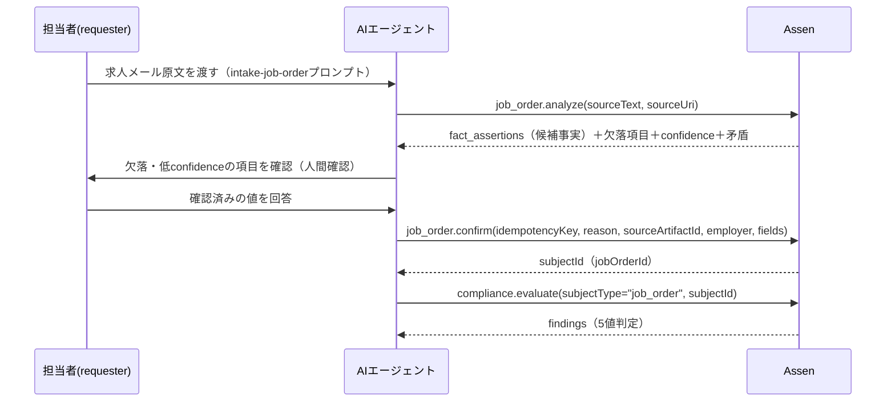
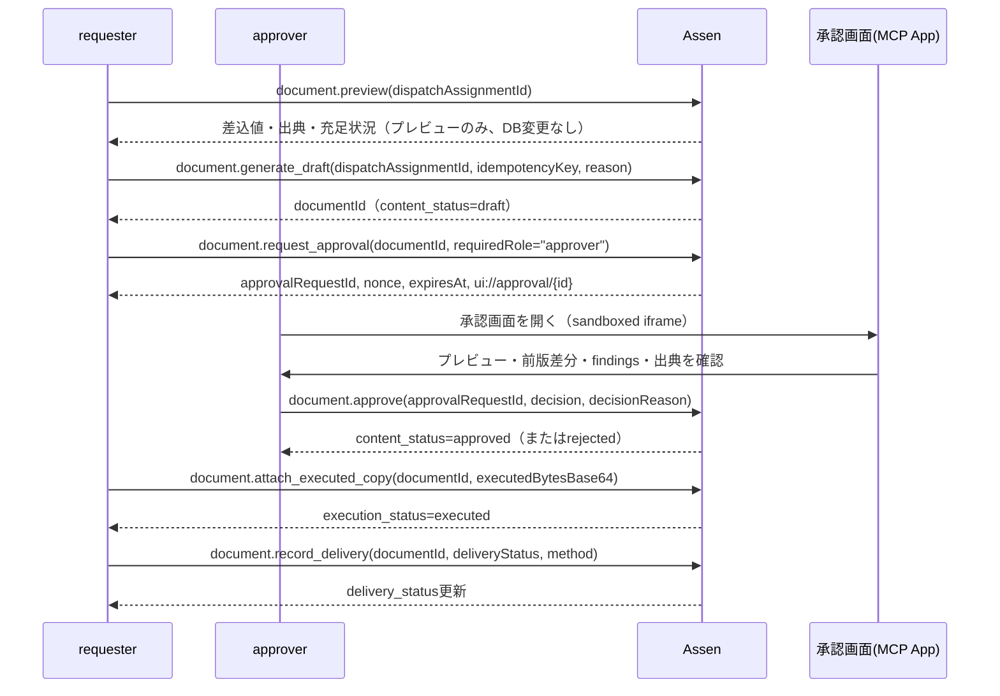

# Assen 使い方指南書（チーム向け） / Assen User Guide (For the Team) / Panduan Pengguna Assen (Untuk Tim)

本ドキュメントは、実際にAssenを使って業務を進めるチームメンバー向けの実践ガイドです。
This document is a hands-on practical guide for team members who use Assen to run their daily operations.
Dokumen ini adalah panduan praktis untuk anggota tim yang menggunakan Assen dalam operasional harian mereka.

**このドキュメントの位置づけ**：

| ドキュメント | 目的 | 読む人 |
|---|---|---|
| [`法定書類自動化MCP_設計書_v1.md`](../../法定書類自動化MCP_設計書_v1.md) | 仕様・法的根拠・意思決定の経緯（正） | 実装者・レビュアー |
| [`README.md`](../README.md) | 実装ガイド（セットアップ・アーキテクチャ・Tool/Resource一覧） | 開発者 |
| **本ドキュメント（`docs/team-guide.md`）** | **実際の使い方（誰が・いつ・どのツールを・どう呼ぶか）** | **業務担当者・エージェント運用者** |

---

## 1. Assenとは（30秒で） / What is Assen (30-second version) / Apa itu Assen (versi 30 detik)

Assenは、職安法・派遣法・労基法の**法定書類・法定帳簿**を、MCP（Model Context Protocol）ツール経由でAIエージェントに生成・管理させるためのサーバーです。

- 求人メールを読み込んで求人管理簿（帳簿①）を確定する
- 労働条件通知書のドラフトを自動生成する
- 承認画面（MCP App）で人間が確認・承認する
- 署名済み正本を添付し、交付記録を残す
- すべての操作をハッシュチェーン付き監査ログに残す（誰が・いつ・何を・どう変えたか）

Assen is an MCP server that lets AI agents generate and manage statutory documents/ledgers for Japanese employment-placement and worker-dispatch law, always gated by human approval and a tamper-evident audit trail.
Assen adalah server MCP yang memungkinkan agen AI menghasilkan dan mengelola dokumen/buku besar wajib untuk hukum penempatan kerja dan dispatch tenaga kerja Jepang, selalu melalui persetujuan manusia dan audit trail yang tahan perubahan.

**重要**：Assenが生成する文書は常に**ドラフト**です。`document.approve`で人間が承認するまで法的に確定しません。AIの判断だけで法定書類が確定することはありません。

---

## 2. 誰が何をするか（role別） / Who does what (by role) / Siapa melakukan apa (berdasarkan role)

Assenの認証主体（principal）は4つのroleを持ちます。呼べるツールはroleごとに制限されています（`assertScope`で強制）。

| role | 想定する担当者 | できること |
|---|---|---|
| `requester` | 求人取込担当・派遣担当（現場の実務担当者） | 求人確定（`job_order.confirm`）、派遣就業確定（`dispatch_assignment.confirm`）、求職者確定（`job_seeker.confirm`）、紹介行確定（`job_order_referral.confirm`）、採否確定（`placement.confirm`）、不採用理由記録（`placement.record_rejection_reason`）、書類ドラフト生成・承認依頼・添付・交付記録・訂正版発行の起票 |
| `approver` | 承認者（管理者・上長） | 承認・差戻し（`document.approve`）、`requester`と同じ起票操作（訂正版発行のみ） |
| `admin` | システム管理者 | 上記すべて |
| `system` | 内部バッチ・outbox worker等（人間は通常使わない） | 現時点ではread系のみ（`compliance.evaluate`・`document.preview`）。write系のtoolはすべて拒否される |

**現在の対象フロー（自社MVP、[`docs/registry-readiness-checklist.md`](registry-readiness-checklist.md)G節）は2つに固定されています**：①純紹介縦切り（[6章](#6-ワークフロー労働条件通知書の作成交付)）、②派遣縦切り（[6.5章](#65-ワークフロー派遣3点書類a2a3a10の作成交付)）。T2P（紹介予定派遣）書類④〜⑨の生成自体は実装済みですが、承認〜交付の運用フローとしては本ガイドの対象外です（生成のみ試す場合は[README](../README.md)のM2 Phase 2節を参照）。

現在の開発環境（`AUTH_MODE=local_fixed_token`）では、認証に成功した接続は全員`admin`ロールとして扱われます（`src/lib/auth.ts`）。つまりローカル検証中はroleによる制限を意識せず全ツールを試せますが、**本番でOAuth接続に切り替わった際にはroleが実際の担当者に紐づく**ため、今のうちに「このツールは本来どのroleの仕事か」を意識しておいてください。

---

## 3. 事前準備 / Prerequisites / Prasyarat

### 3.1 サーバーを起動する

ローカル検証環境の立て方は[`README.md`](../README.md)の「セットアップ」節が正です。要点だけ再掲します。

```bash
cd assen
pnpm install
cp .env.example .env        # PII_ENCRYPTION_KEYはopenssl rand -base64 32等で生成
docker compose up -d        # Postgres + MinIO
node --env-file=.env node_modules/tsx/dist/cli.mjs src/db/migrate.ts
node --env-file=.env node_modules/tsx/dist/cli.mjs src/server.ts
```

起動できたか確認：

```bash
curl http://localhost:8080/health   # {"status":"ok","server":"assen"}
curl http://localhost:8080/ready    # {"status":"ready"}（DB接続も確認済み）
```

### 3.2 AIエージェントから接続する（Cursor / Claude）

AssenはStreamable HTTP transport（`/mcp`）で待ち受けます。**接続方法はエージェントによって設定形式が異なります**（2026-07-24訂正：以前の版ではCursorとClaude Desktopで同じJSON形式を案内していましたが、Claude Desktopの`claude_desktop_config.json`は`url`/`headers`フィールドを受け付けず、設定自体が壊れることが判明したため訂正しました）。

**Cursor**（`~/.cursor/mcp.json`）：

```json
{
  "mcpServers": {
    "assen": {
      "url": "http://localhost:8080/mcp",
      "headers": {
        "Authorization": "Bearer <.envのAUTH_LOCAL_TOKENの値>"
      }
    }
  }
}
```

**Claude Desktop / claude.ai**：`claude_desktop_config.json`に`url`/`headers`を直接書いても認識されず、設定ファイルが壊れる場合があります。代わりに**Settings → Connectors → Add custom connector**（Team/Enterprise管理者は`Admin settings → Connectors`）のUIからURLとRequest headers（`Authorization: Bearer <token>`）を設定してください。詳しい手順は[`docs/claude-quickstart.md`](claude-quickstart.md)を参照してください。

**Claude Code（CLI）**の場合は`claude mcp add --transport http assen <url> --header "Authorization: Bearer <token>"`が使えます。

- トークンの値は`.env`の`AUTH_LOCAL_TOKEN`（ローカル）または3.3節の`pnpm run auth:get-token`（本番相当）の出力と完全一致させてください（不一致だと401 unauthorizedになります）
- トークンはSlack等の平文チャットに貼らないでください。1人1トークンを想定し、共有アカウント運用は避けてください

接続できたか確認するには、エージェントに「Assenで使えるツールを一覧して」と頼むか、`tools/list`を直接呼びます。15個のツール（`job_order.analyze`〜`placement.record_rejection_reason`）が返れば接続成功です。

### 3.3 本番相当環境（Cloud Run）に接続する — 現状 / Connecting to the production-equivalent (Cloud Run) environment — current status / Terhubung ke lingkungan setara produksi (Cloud Run) — status saat ini

**結論（2026-07-24更新）**：Cloud Run／Cloud SQL／GCS／OAuthトークン交換層は**すべて実際に構築・稼働中で、Google Workspaceログイン→Assen JWT→`tools/list`成功のE2Eテストも通過済み**です（[`docs/ops-runbook.md`](ops-runbook.md)実行結果参照）。

- runtime URL: `https://assen-runtime-000000000000.asia-northeast1.run.app`
- `GOOGLE_OAUTH_CLIENT_ID`は実際の値を設定済み（`000000000000-REDACTED.apps.googleusercontent.com`）
- **認証はアプリ層の`AUTH_MODE=oauth`（Bearer JWT検証、`src/lib/auth.ts`）のみ**。Cloud Run自体のIAM認証（`roles/run.invoker`）は`allUsers`に開放済み（`--no-allow-unauthenticated`のままだと、`/oauth/token-exchange`という「まだAssen JWTを持っていない人向けの入口」自体がGoogle Frontendにブロックされて機能しないため）。**ネットワーク層の追加防御（IAP／VPN）は2026-07-24に壁が意図的に見送りを決定**（ドメイン・VPN機器の前提が無いため。[`docs/ops-runbook.md`](ops-runbook.md)8節参照）。**現状の実質的なアクセス制御はTOKEN_EXCHANGE_ALLOWLIST_JSON（許可されたWorkspaceメールのみ）に完全に依存している点を理解した上で利用してください**

**接続手順（実際に動作確認済み）**：

1. リポジトリの`apps/compliance`で`pnpm run auth:get-token`を実行する（初回のみ以下の環境変数が必要。値は壁に確認）：
   ```bash
   export GOOGLE_OAUTH_CLIENT_ID="000000000000-REDACTED.apps.googleusercontent.com"
   export GOOGLE_OAUTH_CLIENT_SECRET="<壁に確認>"
   export ASSEN_BASE_URL="https://assen-runtime-000000000000.asia-northeast1.run.app"
   pnpm run auth:get-token
   ```
2. ブラウザが自動で開くので、Google Workspaceアカウントでログインする
3. ターミナルに出力されたAssenアクセストークン（**8時間有効**。2026-07-24に`TOKEN_EXCHANGE_TOKEN_TTL_SECONDS=28800`へ変更済み、1日の勤務時間をカバーする設定）を、Cursorなら`mcp.json`の`Authorization: Bearer`に、Claudeなら[3.2節](#32-aiエージェントから接続するcursor--claude)の方法で設定する
4. 自分のemailが`TOKEN_EXCHANGE_ALLOWLIST_JSON`（社内allowlist）に登録されていない場合、「許可されていません」というエラーになります。壁にallowlistへの追加を依頼してください
5. トークンは8時間で失効するので、切れたら`pnpm run auth:get-token`を再実行してください

`client_secret`は現状ローカルスクリプト実行時のみ必要な値で、Assenサーバー自体には保存されません（Google ID Token検証はJWKS署名検証のみで行うため）。Slack等の平文チャットには貼らないでください。

---

## 4. 基本の使い方：エージェントに自然言語で頼む / Basic usage: ask the agent in natural language / Cara dasar: minta agen dalam bahasa natural

Assenのツールを直接JSON RPCで呼ぶ必要は普段ありません。CursorやClaudeなどのAIエージェントに**業務プロンプト（MCP Prompts）**を使って自然言語で依頼してください。

| Prompt名 | いつ使うか | 渡す情報 |
|---|---|---|
| `intake-job-order` | 求人メールを受け取った時 | `sourceText`（原文全文）, `sourceUri`（Slackリンク等） |
| `review-pending-approvals` | 承認依頼が来た時 | `approvalRequestId` |
| `correct-document` | 承認済み文書に誤りが見つかった時 | `documentId`, `reason`（訂正理由） |

例えば承認者は、Slack通知で承認依頼IDを受け取ったら、エージェントに

> `review-pending-approvals`プロンプトを`approvalRequestId=xxxx`で実行して

と頼むだけで、プレビュー確認→findings確認→承認/差戻しの一連の手順をエージェントが案内してくれます。プロンプトを使わず「求人メールを取り込んで」と頼んでも、エージェントはツールの`description`（日本語で書かれています）を読んで適切な順序で呼び出します。

以降の章では、エージェントが裏側で何を呼んでいるかを理解できるように、各ワークフローをツール呼び出しレベルで説明します。**トラブル時の原因調査や、エージェントが誤った順序で呼んでいないかの確認に使ってください。**

---

## 5. ワークフロー①：求人受付〜求人管理簿（帳簿①）確定 / Workflow 1: job-order intake to Ledger #1 / Workflow 1: intake lowongan hingga Buku Besar #1



### 手順

1. **`job_order.analyze`** — 求人メールの原文をそのまま渡します。**DBへの確定記帳は行いません**（read専用、何度呼んでもやり直せます）。原文は不変保存（`source_artifacts`）され、SHA-256で追跡可能になります。
   - 入力：`sourceText`（原文全文）、`sourceUri`（Slackメッセージリンク等）
   - 出力：`sourceArtifactId`、候補事実（fact_assertions）、欠落項目、confidence、矛盾の指摘
2. **人間確認**：LLMが抽出した値を鵜呑みにせず、欠落・低confidence・矛盾がある項目は担当者に確認します。これは`analyze`の直後、`confirm`を呼ぶ**前**に必ず挟む工程です。
3. **`job_order.confirm`** — 確認済みの値で帳簿①へ確定記帳します。`requester`または`admin`のみ呼べます。
   - 必須：`idempotencyKey`（同一操作の再実行対策。1回の起票につき1つの一意な値を使う）、`reason`、`sourceArtifactId`、`employer`（事業所名・所在地・代表者・担当者）、`fields`（受付年月日・有効期間・求人数・職種等）
   - `confirmed_by`は入力せず、認証主体（あなたのトークンに紐づくprincipal）から自動的に導出されます
4. **`compliance.evaluate`** — 確定した求人が法定必須項目を満たしているか確認します（read専用）。5値判定の意味は[9章](#9-法令判定complianceevaluateの見方)を参照してください。

実際のツール呼び出し例（JSON、`scripts/smoke-e2e.sh`より）は本リポジトリの[`scripts/smoke-e2e.sh`](../scripts/smoke-e2e.sh)で確認できます。

---

## 6. ワークフロー②：労働条件通知書の作成〜交付 / Workflow 2: labor-conditions-notice creation to delivery / Workflow 2: pembuatan hingga pengiriman pemberitahuan kondisi kerja

これがM1で通した「縦切り1本」の本体です。



### 手順

1. **`document.preview`**（read専用）：生成前に、差込値・出典（LLMがどこから読み取ったか）・法定必須項目の充足状況を確認します。DBは変更しません。何度でも確認し直せます。
2. **`document.generate_draft`**：テンプレートから労働条件通知書のドラフトを生成し、GCS/MinIOへcontent-addressable（SHA-256キー）に保存します。`content_status`は`draft`になります。
   - `idempotencyKey`・`reason`が必須です。**同一`idempotencyKey`で再実行しても新しいdraftは作られず、既存のものが返ります**（リトライで文書が増殖する事故を防ぐための冪等性実装）
3. **`document.request_approval`**：承認依頼を作成します。承認対象文書のハッシュ・nonce（一意な使い捨て値）・期限を紐づけます。戻り値の`ui://approval/{approvalRequestId}`が承認画面へのリンクです。
4. **承認画面（MCP App）を開いて確認する**：詳細は[7章](#7-承認画面mcp-appの見方と使い方)。
5. **`document.approve`**（`approver`または`admin`のみ）：承認または差戻し。承認者はトークンのprincipalから自動導出され、入力で「誰が承認したか」を指定することはできません（なりすまし防止）。
   - `ambiguous`／`expert_review_required`のfindingsが1件でも残っていると、サーバー側で承認が**強制的にブロック**されます（差戻しは可能）
   - 承認依頼作成後に対象文書のハッシュが1バイトでも変わっていた場合、承認は自動的に無効化（`decision=rejected`, `decisionReason=artifact_hash_mismatch`）されます
   - `expiresAt`を過ぎた承認依頼は承認できず、自動的に`expired`になります
6. **`document.attach_executed_copy`**：署名済み正本（紙のスキャンや電子署名済みPDF）をbase64で添付し、SHA-256を記録します。`execution_status`が`executed`になります。ファイルサイズはbase64で約15MB相当（decoded後）が上限です。
7. **`document.record_delivery`**：交付方法（メール・Slack・対面等）・日時・電子交付同意・メッセージIDを記録します。`deliveryStatus`は`queued`→`sent`→`delivered`（または`failed`）と遷移させます。外部送信を伴うため、必ず`document.preview`等で内容を確認した後に呼んでください。

---

## 6.5 ワークフロー：派遣3点書類（A2/A3/A10）の作成〜交付 / Workflow: dispatch 3-document set (A2/A3/A10) creation to delivery / Workflow: pembuatan hingga pengiriman set 3-dokumen dispatch (A2/A3/A10)

自社MVPの2つ目の対象フローです。[6章](#6-ワークフロー労働条件通知書の作成交付)の労働条件通知書と**同じ承認〜交付パイプライン**を使い、対象文書がA2（派遣個別契約書）・A3（派遣労働条件通知書）・A10（派遣労働者通知書）に変わるだけです（[`test/m2-dispatch-approval-e2e.test.ts`](../test/m2-dispatch-approval-e2e.test.ts)で3docType×1本ずつ通過を確認済み）。

### 手順

1. **`dispatch_assignment.confirm`**：派遣就業を確定し、同時にA4派遣元管理台帳（`dispatch_ledger_entries`）へ自動記帳します（`job_order.confirm`と同じ発想）。`requester`または`admin`のみ呼べます。
   - 必須：`idempotencyKey`・`reason`・`worker`（氏名・住所・国籍等）・`client`（派遣先事業所名・所在地・代表者）・`assignment`（契約期間・就業場所・抵触日等）・`ledgerEntry`（協定対象労働者か否か・無期雇用か否か・社会保険加入状況等）
   - 出力：`dispatchAssignmentId`（以降、[6章](#6-ワークフロー労働条件通知書の作成交付)の`dispatchAssignmentId`と同じ位置で使う`subjectId`になります）
2. **`document.preview` / `document.generate_draft`**：`docType`に`dispatch_individual_contract`（A2）・`dispatch_working_conditions_notice`（A3）・`dispatch_worker_notice`（A10）のいずれかを指定します。`subjectId`には手順1の`dispatchAssignmentId`を渡します。以降は[6章](#6-ワークフロー労働条件通知書の作成交付)の手順3〜7（`request_approval`→`approve`→`attach_executed_copy`→`record_delivery`）と完全に同じです
3. **1件の派遣就業につき、A2/A3/A10の3文書すべてで手順2を繰り返す必要があります**（`docType`を変えて別々に`generate_draft`・承認・交付を行う。1つの`dispatchAssignmentId`から3つの独立した`documentId`が作られます）

**注意**：A2/A3/A10のテンプレートは既存様式の転記であり、**社労士による法的レビューは未実施**です（[`docs/registry-readiness-checklist.md`](registry-readiness-checklist.md)B節参照）。生成された文書は「社内検証用ドラフト・対外提出前に人が最終確認」の前提で扱ってください。

---

## 7. 承認画面（MCP App）の見方と使い方 / How to read and use the approval screen / Cara membaca dan menggunakan layar persetujuan

`document.request_approval`が返す`ui://approval/{approvalRequestId}`リンクを開くと、sandboxed iframe内に以下が1画面で表示されます。

| セクション | 表示内容 |
|---|---|
| ヘッダー情報 | document_id・version・doc_type・content_status・approval_request_id・nonce・required_role・requested_by・requested_at・expires_at・artifact_sha256 |
| 生成文書プレビュー | 労働条件通知書の実際の本文テキスト |
| 前版との差分 | 訂正版（`document.supersede`後）の場合、旧版とのdiff（追加行は緑・削除行は赤） |
| 法定必須項目の充足状況・矛盾・信頼度 | findingsテーブル（severity・rule・result・message・missing fields） |
| 出典 | 各値がどこから来たか（`source_locator`へのリンク） |
| 承認後に起こる処理 | 承認したら次に何が起きるか（`nextActions`） |
| 操作 | 判断理由の入力欄＋「承認」「差戻し」ボタン |

**画面に表示されるが操作できないもの**：訂正（`document.supersede`）と署名済みコピー添付（`document.attach_executed_copy`）は、この画面からは実行できません（案内表示のみ）。別途エージェントに依頼してください。これは業務データをクライアント側に保持しない設計上の意図的な制約です。

**承認ボタンを押すと何が起きるか**：

1. 判断理由（`decisionReason`）を必ず入力する必要があります（未入力だとアラートが出ます）
2. blockingなfindingsが残っている場合、承認ボタンは無効化されます（差戻しは可能）
3. ボタンクリックで`document.approve`ツールが呼ばれます。呼び出し方法はMCPクライアントの対応状況により自動的に切り替わります：
   - `window.openai.callTool`対応クライアント（OpenAI Apps SDK方式）
   - `postMessage`対応クライアント（mcp-ui方式）
   - どちらも未対応の場合、手動実行用のJSONが画面に表示されるので、それをチャットにコピー＆ペーストしてエージェントに実行してもらってください

---

## 8. ワークフロー③：訂正が必要になったら / Workflow 3: when a correction is needed / Workflow 3: saat koreksi diperlukan

承認済み文書に誤りが見つかった場合、**既存のdocument行を直接書き換えることは絶対にできません**（改ざん防止のため、旧版はそのまま保持されます）。

1. `document.supersede`（`requester`・`approver`・`admin`いずれも可）を、`documentId`・`reason`（訂正理由、必須）・`correctedValues`（訂正後の差込値）で呼びます
2. 旧版は`content_status=superseded`になり、新版（version+1）が`draft`として発行されます
3. 新版に対して[6章](#6-ワークフロー労働条件通知書の作成交付)の`document.request_approval`以降を再度実行します

`correct-document`プロンプトを使えば、この一連の流れをエージェントに任せられます。

---

## 9. 法令判定（compliance.evaluate）の見方 / How to read compliance.evaluate results / Cara membaca hasil compliance.evaluate

`compliance.evaluate`・`document.preview`・承認画面が返す`findings`は、**5値のいずれか1つ**を持ちます。LLMはこの判定に一切関与しません（決定論的ルールエンジンのみ）。

| result | 意味 | 承認への影響 |
|---|---|---|
| `pass` | 法定要件を満たしている | ブロックしない |
| `fail` | 明確に要件を満たしていない | ブロックしない（`document.approve`は通るが、業務上は放置しないこと） |
| `incomplete` | 必要な情報が不足している | ブロックしない（`missingFields`を確認して補完する） |
| `ambiguous` | 判定に必要な条件が曖昧・複数解釈が可能 | **`document.approve`を強制ブロック** |
| `expert_review_required` | 社労士・弁護士等の専門家判断が必要 | **`document.approve`を強制ブロック** |

**重要な設計原則**：`ambiguous`・`expert_review_required`を`pass`へ勝手に書き換えるコードパスは存在しません（`assertNoBlockingFindings`が唯一のゲート）。この2つのfindingsが残っている限り、AIエージェントにどう指示しても承認は通りません。**専門家に相談し、findingを解消してから再度評価してください。**

---

## 10. 監査ログの確認方法 / How to check the audit log / Cara memeriksa log audit

すべての状態変更は`assen://audit/{subjectType}/{subjectId}`リソースから確認できます。各イベントには以下が必ず記録されています：

- `actorPrincipalId`（誰が）
- `occurredAt`（いつ）
- `aggregateVersion`（何版に対して）
- `afterHash`（操作後の状態のハッシュ）
- `eventHash` / `previousEventHash`（前のイベントとチェーンされたハッシュ。改ざんがあれば検証で必ず検出される）

エージェントに「job_order {id} の監査ログを見せて」と頼めば、このリソースを読んで時系列に整理して見せてくれます。チェーン全体の整合性は`npm run audit:verify`で機械的に検証できます（開発者向け）。

---

## 11. よくあるエラーと対処法 / Common errors and how to resolve them / Error umum dan cara mengatasinya

| エラー・症状 | 原因 | 対処 |
|---|---|---|
| `401 unauthorized` | Bearerトークンが`.env`の`AUTH_LOCAL_TOKEN`と不一致 | mcp.jsonの`Authorization`ヘッダーを確認する |
| `権限不足です（必要role: ...）` | あなたのroleでは呼べないツールを呼んだ（本番OAuth接続時） | 該当roleを持つ担当者に依頼する。ローカル`local_fixed_token`環境では全員`admin`なので発生しない |
| `Invalid content_status transition` | すでに別の状態に遷移済みの文書に対して操作した（例：承認済み文書を再度request_approval） | 対象の現在状態を`document.preview`や監査ログで確認する |
| 承認が`decisionReason=artifact_hash_mismatch`で自動的にrejectされた | 承認依頼作成後に対象文書のバイト列が変わった（バグ・競合更新） | 新たに`document.request_approval`を作り直す。原因調査は監査ログの`afterHash`列で追う |
| 承認依頼が`expired`になっている | `expiresAt`を過ぎた | 新たに`document.request_approval`を作り直す |
| 承認ボタンが押せない（無効化されている） | blockingなfindings（`ambiguous`／`expert_review_required`）が残っている | 専門家に相談しfindingを解消する。差戻しは可能 |
| `413 payload_too_large` | リクエストボディまたは`executedBytesBase64`が上限超過（既定20MB／約15MB相当） | ファイルを圧縮する、または分割を検討する |
| 同じdraftが複数できたように見える | `idempotencyKey`を毎回変えて`document.generate_draft`を呼んでいる | 同一操作の再実行では同じ`idempotencyKey`を使う（新規操作なら新しいキーを使う） |

---

## 12. セキュリティ上、絶対にやってはいけないこと / Security: things you must never do / Keamanan: hal yang tidak boleh dilakukan

- Bearerトークンをチャット・チケット・Slackの平文メッセージに貼らない
- 在留カード・パスポート等の画像をAssen経由でアップロード・保存しようとしない（Assenのスコープ外。OCR処理後は即破棄が原則）
- `document.approve`の`decisionReason`に個人情報の詳細を書きすぎない（監査ログに永続保存されるため）
- 承認者以外が「承認者になりすます」ためにトークンを共有しない（`approved_by`はトークンから自動導出されるため、共有は事実上のなりすまし）
- `ambiguous`／`expert_review_required`のfindingsを消すためにルール定義（`legal_rules`）を勝手に書き換えない（法的意見書のレビューを経ずに判定基準を変えることは重大リスク）

---

## 13. 困ったときの連絡先 / Where to ask for help / Ke mana harus bertanya jika ada masalah

設計書§10「三層との接続」に基づく現行の窓口：

- **求人取込・承認・期限に関する業務的な質問**：Slack `#20_派遣管理`
- **求人取込の入口（analyzeの結果がおかしい等）**：Slack `#10_deal_desk`
- **Assen自体の不具合・仕様確認**：Slack `#90_dev`
- **法令解釈・findingsの是正方法**：社労士・弁護士へのエスカレーション（該当findingの`ruleKey`と`message`を添えて相談する）

---

## 14. 用語集 / Glossary / Glosarium

| 用語 | 説明 |
|---|---|
| `idempotencyKey` | 同一操作の再実行で副作用（documentの重複作成等）を1回だけに保つための一意なキー。1回の業務操作につき1つ使う |
| `nonce` | 承認依頼1件ごとに発行される一意な使い捨て値。承認対象の取り違え防止に使う |
| `subjectType` / `subjectId` | 判定・監査の対象を指す型とID（例：`job_order`とそのUUID） |
| `content_status` | 文書の承認状態（`draft` → `under_review` → `approved`/`rejected`/`expired` → `superseded`） |
| `execution_status` | 署名済み正本の添付状態（未添付 → `executed`） |
| `delivery_status` | 交付状態（`queued` → `sent` → `delivered`／`failed`） |
| `finding` | 決定論的ルール判定の1件分の結果（5値のいずれか） |
| `evidenceRefs` | 判定・生成の根拠となるリソースURI一覧（出典） |
| `chain_sequence` / `event_hash` / `previous_event_hash` | audit_eventsのハッシュチェーン。改ざん検知に使う |
| `principal` | 認証済みの操作主体。`principalId`・`role`・`tenantId`を持つ（`resolvePrincipal`が導出） |

---

## 15. 関連ドキュメント / Related documents / Dokumen terkait

- **Claude接続クイックスタート（最短手順のみ）**: [`docs/claude-quickstart.md`](claude-quickstart.md)
- 仕様の正: [`法定書類自動化MCP_設計書_v1.md`](../../法定書類自動化MCP_設計書_v1.md)
- 実装ガイド: [`README.md`](../README.md)
- 実際のツール呼び出し例（curl/jq）: [`scripts/smoke-e2e.sh`](../scripts/smoke-e2e.sh)
- 客観ゲート検証テスト: [`test/m0-gate.test.ts`](../test/m0-gate.test.ts)・[`test/m1-gate.test.ts`](../test/m1-gate.test.ts)・[`test/m2-dispatch-approval-e2e.test.ts`](../test/m2-dispatch-approval-e2e.test.ts)
- 本番相当環境の構築手順（未実行・壁が手動実行する）: [`docs/ops-runbook.md`](ops-runbook.md)
- 初回社内シャドーランの手順: [`docs/shadow-run-runbook.md`](shadow-run-runbook.md)
- 自社MVPゲートの進捗管理: [`docs/registry-readiness-checklist.md`](registry-readiness-checklist.md)G節
